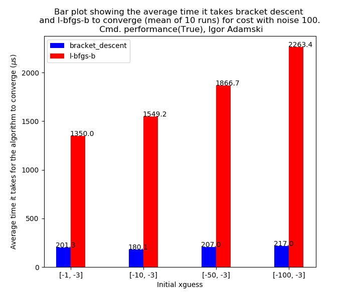
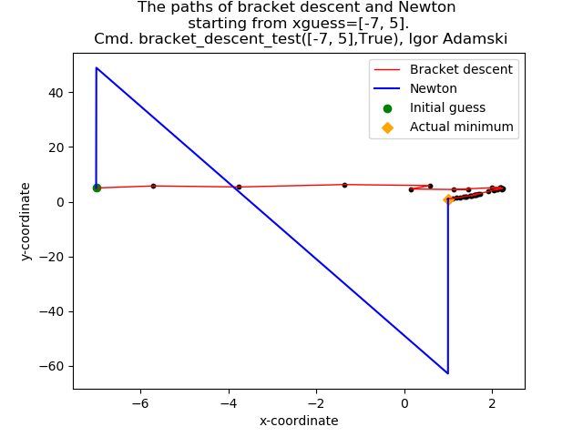
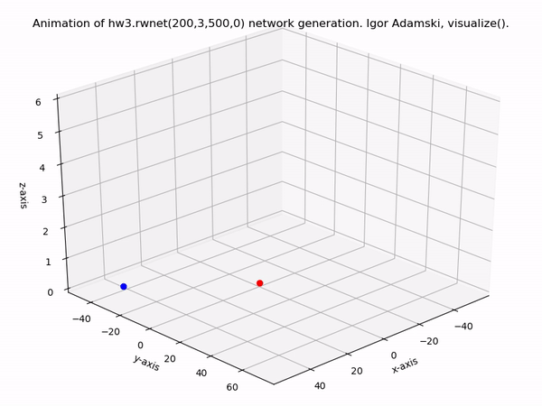
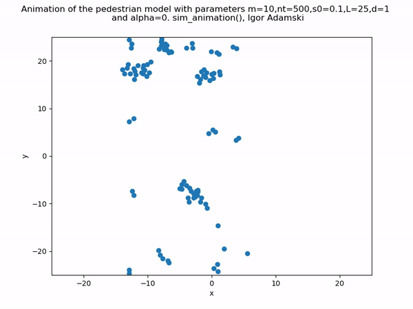
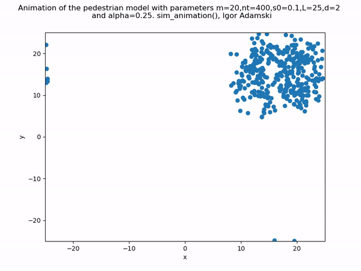
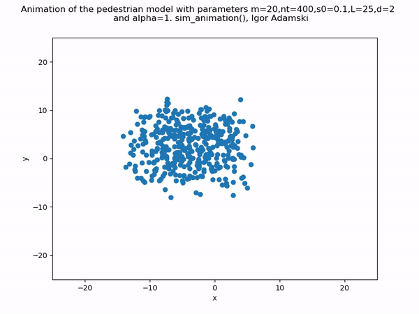

# High Performance Computing Module
This repository contains code for assessment of the M3C High Performance Computing module, taught in 2017 by Prasun Ray at Imperial College London. 

Below are listed some of the more useful and insightful parts of the work, with some graphs to make things interesting.

## Optimization (Newton's method, LBFGS and bracket descent)

In the [cw2/hw2.f90](cw2/hw2.f90) file you can find simple implementations of the Newton optimisation algorithm (second order method) and an implementation of a simple bracket descent algorithm. Both these methods require full knowledge of the cost function (for our toy example given in [cw2/cost.f90](cw2/cost.f90)). To use as a module in python compile the hw2.f90 file using [f2py](https://docs.scipy.org/doc/numpy/f2py), so that a hw2mod.cpython-36m-darwin.so file is created.

The bracket descent algorithm works by randomly placing a triangle on the initial guess point and recentering it on the vertex with the highest/lowest value of the cost function it wants to optimize. It requires a lot of steps to converge but the Fortran implementation makes it extremely quick. Here's graphs comparing it to LBFGS and Newton:

LBFGS vs Bracket Descent  |  Newton vs Bracket Descent
:-------------------------:|:-------------------------:
  |  

### OpenMPI implementation of global bracket descent and more random networks

A Fortran implementation of a modified version of bracket descent, using OpenMPI paralellization is given in [project/p12.f90](project/part1/p12.f90) and paralellization technique explained in the subroutine bdglobal_mpi.

## 3D-Random Walk Network Generation

The third coursework was mainly based on using [OpenMP](https://www.openmp.org) to paralellize simple network generation on the processor cores. A nice movie showing the end product of the network generation is presented below. The nodes are dropped from a point [0,X] and undergo a biased random walk until they either hit the ground (the x=0 axis) or are in close proximity to another node in the network, connecting to them.

## Random pedestrian model (distributed in OpenMP)

A interesting model of pedestrians walking is implemented in [project/part2](project/part2). In this model pedestrians begin in a uniform grid in the middle of the coordinate system and start walking in random directions. Number of parameters determine their speed, 'connectivity' (once a person bumps into someone they start walking in similar directions) and direction randomness. Some movies illustrating that:

:-------------------------:|:-------------------------:|:-------------------------:
  |   | 

## Wave propagation in a random-walk network

A differetial model was considered to propagate a wave through the random-walk generated network (as in the 3D animation above). The solution involves solving a partial differential equation numerically and is implmented in Fortran using OpenMPI paralellization.

